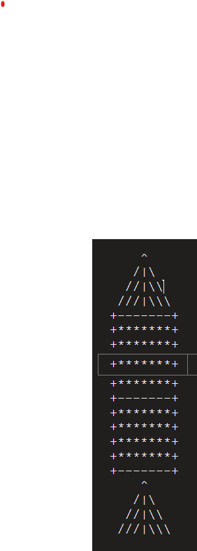

# My first exercise in python 



```python
def kolahak(h): 
    print("       ^     ") 
    for i in range(h):  
        print(" "*(h+1-i),end="")
        print("/"*(i+1), end="")
        print("|", end="")
        print("\\"*(i+1))
    print(" +"+"-"*(2*h+1)+"+") 

def sookht(w,h):
    for i in range (h):
        print(" +" + "*"*w+"+" )  
    print(" +"+"-"*w+"+" ) 
```